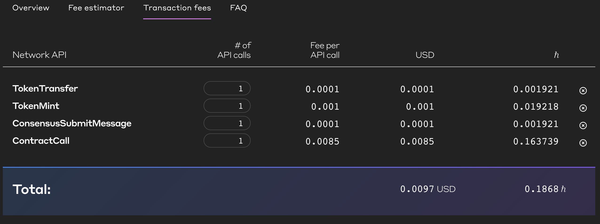
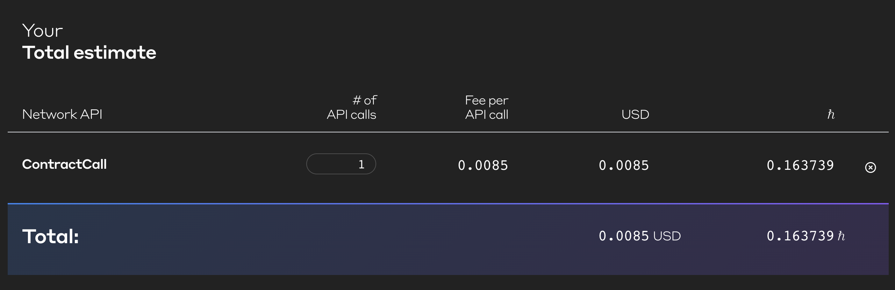

# Fees Checking

#### Token Transfer fees: `0.001 USD / 0.020179 h`
#### Token Mint: `0.001 USD / 0.019218 h`
#### Token Burn: `0.001 USD / 0.019218 h`
#### Contract call basic @ `100,000` Gas : `0.0085 USD / 0.163739 h`
#### Ledger Update: `0.0001 USD / 0.001921 h`

- Fund Accunt
    - If cold wallet is having sufficient balance
        - Transfer: 1
        - Mint: 0
        - Contract Interaction: 1
        - Ledger Update: 1
    - else
        - Transfer: 1
        - Mint: 1
        - Contract Interaction: 1
        - Ledger Update: 1

    - Fund Wallet `0.1868 h / $0.0097`

- AcceptPayment
    - Calls
        - Transfer: 2
        - Mint: 0
        - Contract Interaction: 1
        - Ledger Update: 2
    - Accept Payment `0.20794 h / $ 0.0108`

- SettleCrypto
    - Calls
        - Burn: 1
        - Ledger Update: 2
        - Contract Interaction: 1
    - Settle Payment `0.1868 h / $0.0097`

- SettleFiatFromLP
    - Calls
        - Transfer: 2
        - Mint: 0
        - Contract Interaction: 1
        - Ledger Update: 2
    - Settle Fiat From LP `0.20794 h / $ 0.0108`

- ExchangeFriddyPCoins
    - Calls
        - Transfer: 1
        - Burn: 1
        - Contract Interaction: 1
        - Ledger Update: 2
    - Exchange FriddyP Coins `0.0107 h / $ 0.20698`

 

 

